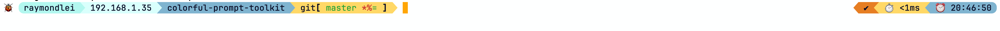
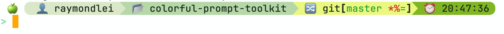
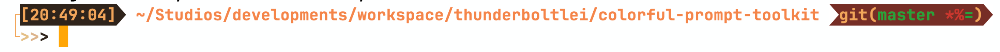
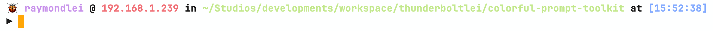
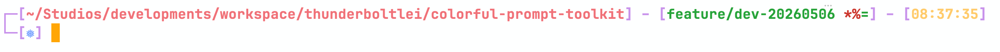
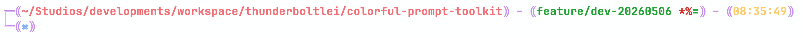
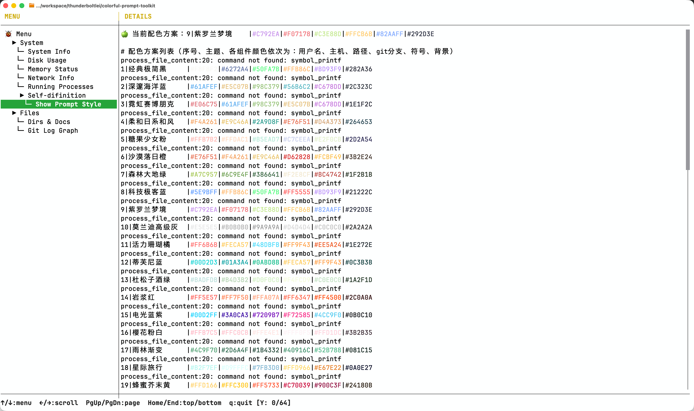

<p align="center">
  <a href="https://github.com/ThunderboltLei/colorful-prompt-toolkit">
    
  </a>
</p>

# Colorful Prompt Toolkit
[](https://github.com/ThunderboltLei/colorful-prompt-toolkit/actions/workflows/CI.yml)
[](https://github.com/ThunderboltLei/colorful-prompt-toolkit/actions/workflows/CodeQL.yml)


Colorful Prompt Toolkit is an open-source project dedicated to beautifying terminal prompts. It transforms the plain command line into an intuitive and visually appealing interface by offering rich color schemes, custom icons, and dynamic information such as Git branches, execution time, and current directory. Compatible with various shells like Bash and Zsh, users can easily adjust themes to enhance both the development experience and visual enjoyment. Ideal for daily development, system administration, and presentation scenarios, it makes command-line operations more efficient and personalized.

# Thanks
Thank you to the authors of the *[Git](https://github.com/git/git)* project for providing the git-prompt script.

# Installation
```
$ git clone <colorful-prompt-toolkit>

$ vim .zshrc
source <your path>/colorful-prompt-toolkit/my-colorful-prompt-toolkit.zsh

$ source .zshrc
```

# Configuration
The configuration is very simple. All you need to do is modify the configuration items in the prompt-settings.zsh script in the configs directory, and then you can use the style you prefer on the terminal. Isn't it very simple?

```text
# type：1/2
export MY_COLORFUL_PROMPT_TYPE=1

# color number: You can select the line numbers of the styles to be used in the "colorful-style.txt" file under the "style" directory.
export MY_COLORFUL_PROMPT_COLOR_NUMBER=3
```

# How to generate color combinations?
The following prompt statements can be used in AI tools, such as DouBao, DeepSeek, etc.
```
List the top 50 color combinations for the prompt. The prompt consists of: serial number, topic, username, host, path, git branch, symbol and background. All the generated prompt contents should be separated by "|". The serial number content should increment from 1. The topic content is the prompt title. The colors of username, host, path, git branch, symbol and background are in HEX format. Generate plain text content. Generate the content strictly according to my requirements.
```
Copy the generated result to the "colorful-style.txt" file. Then, modify the value of the configuration item "MY_COLORFUL_PROMPT_COLOR_NUMBER" in the configuration file "prompt-settings.zsh". Just enter any command in the terminal and you will see the brand new effect.

<font color=Red>Note: </font><br/>
1、Before updating the content of the "colorful-style.txt" file, it is advisable to make a backup first.<br/>
2、If the text cannot be displayed correctly in the terminal, you need to install the font that supports "Nerd".<br/>

# Show Time
## Ninja
```
This is the default format. Just set the configuration item "MY_COLORFUL_PROMPT_TYPE=1".
```
<p align="center">
  <a href="https://github.com/ThunderboltLei/colorful-prompt-toolkit">
    
  </a>
</p>

## Triangle Crumbs
```text
Just set the configuration item "MY_COLORFUL_PROMPT_TYPE=2".
```
<p align="center">
  <a href="https://github.com/ThunderboltLei/colorful-prompt-toolkit">
    
  </a>
</p>

## Finch
```text
Just set the configuration item "MY_COLORFUL_PROMPT_TYPE=3".
```
<p align="center">
  <a href="https://github.com/ThunderboltLei/colorful-prompt-toolkit">
    
  </a>
</p>

## Interval Finch
```text
Just set the configuration item "MY_COLORFUL_PROMPT_TYPE=4".
```
<p align="center">
  <a href="https://github.com/ThunderboltLei/colorful-prompt-toolkit">
    
  </a>
</p>

## Long Path
```text
Just set the configuration item "MY_COLORFUL_PROMPT_TYPE=5".
```
<p align="center">
  <a href="https://github.com/ThunderboltLei/colorful-prompt-toolkit">
    
  </a>
</p>

## Sentence
```text
Just set the configuration item "MY_COLORFUL_PROMPT_TYPE=6".
```
<p align="center">
  <a href="https://github.com/ThunderboltLei/colorful-prompt-toolkit">
    
  </a>
</p>

## Skaro
```text
Just set the configuration item "MY_COLORFUL_PROMPT_TYPE=7".
```
<p align="center">
  <a href="https://github.com/ThunderboltLei/colorful-prompt-toolkit">
    
  </a>
</p>

## Skaro Doublet
```text
Just set the configuration item "MY_COLORFUL_PROMPT_TYPE=8".
```
<p align="center">
  <a href="https://github.com/ThunderboltLei/colorful-prompt-toolkit">
    
  </a>
</p>

# Extensible to your own prompts
```text
$ cd types

Copy the file prompt-color-<symbol>.zsh of your own.

$ vim my-colorful-prompt-toolkit.zsh

case $MY_COLORFUL_PROMPT_TYPE in
1)
    source $MY_COLORFUL_PROMPT_ROOT_PATH/types/prompt-color-default.zsh
    ;;
2)
    source $MY_COLORFUL_PROMPT_ROOT_PATH/types/prompt-color-t2.zsh
    ;;
<symbol>)
    source $MY_COLORFUL_PROMPT_ROOT_PATH/types/prompt-color-<symbol>.zsh
    ;;
*)
    source $MY_COLORFUL_PROMPT_ROOT_PATH/types/prompt-color-default.zsh
    ;;
esac
```
# Menu Function
The menu function is an additional and powerful feature of Prompt. By default, it is set up so that the menu can be displayed by simply double-clicking on "h". In the menu function, users can customize the menu items, allowing them to integrate more query requirements and simplify the daily viewing of work for users.

<p align="center">
  <a href="https://github.com/ThunderboltLei/colorful-prompt-toolkit">
    
  </a>
</p>

## Add custom menu items
Just add the corresponding custom menus in the MENU_ITEMS and ORDER_ITEMS sections of the prompt-settings.zsh file. <br/>

Note:<br/>
MENU_ITEMS: Menu item name<br/>
ORDER_ITEMS: Custom command<br/>
```text
MENU_ITEMS=(
    ......

    "<Custom Menu Item>"
)
ORDER_ITEMS=(
    ......

    "<Custom Orders>"
)
```

Each "order_item" is a shell script, and the specific functions it performs are up to the user to implement. It is necessary to implement strictly in accordance with the function specifications in the "resources/menu_items/template-menu_item.zsh" script.
```text
# Description: 菜单项对应的业务函数
# Params: 无
#   param1: 
#   param2: 
# Result: 输出要显示的内容
# 
menu_function() {
    # 菜单项执行的业务逻辑
}

# 不要修改，固定写法
if [[ "$1" == "menu_item" ]]; then
    menu_function
fi
```

Note: <br>
The scripts for the added menu items should not implement overly complex business logic; otherwise, it may cause the project to get stuck.
